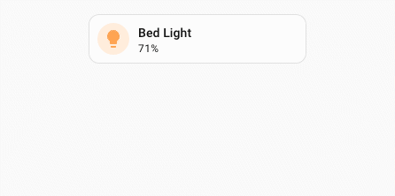

# UIX actions

UIX has several custom actions which can be used on Home Assistant Frontend dashboards. These are invoked using `action: fire-dom-event` with a `uix:` object to set the action and any parameters set in the `data:` object. UIX actions can be used on any card that supports the `fire-dom-event` action which includes all standard Home Assistant cards.

!!! info
    UIX action `data:` object parameters are as required by the Home Assistant event called and are not chosen by UIX. This gives rise to multiple `action` config items which may be confusing. However, each has their place. If you have any issues make sure to follow the documented config for each UIX action.

```yaml
# ... card config
  tap_action:
    action: fire-dom-event
    uix:
      action: <action>
      data:
        <action-data>
```

!!! info
    `action: clear_cache` and `action: more_info` are also valid config and translate to `action: clear-cache` and `action: more-info` respectively.

## `clear-cache` - clearing Home Assistant Frontend cache

Clears the Home Assistant Frontend Application cache and reloads the Browser - localStorage remains untouched. This can be very convenient especially for devices where the option is hidden in a debugging menu and will also clear more than just the Frontend Application cache (e.g. localStorage which clears out many stored items like Browser Mod Browser ID).

| config | setting | default | description |
| --- | --- | --- | --- |
| `action: clear-cache` | - | - | Clears the Home Assistant Application cache and reloads the Browser. |
| `data:` | - | - | not used |

Example button to clear cache and reload.

```yaml
show_name: true
show_icon: true
type: button
name: Clear Frontend Cache
tap_action:
  action: fire-dom-event
  uix:
    action: clear-cache
```

## `more-info` - show Home Assistant more-info for an entity with starting view

Shows the Home Assistant more-info dialog with the option to set the starting view of the more-info dialog.

| config | setting | default | description |
| --- | --- | --- | --- |
| `action: more-info` | - | - | Shows the Home Assistant more-info dialog with entity and view options set with `data:` |
| `data:` | - | - | More-info entity and view options. |
| | `entity` | - | Entity Id of the entity for which to show more-info. |
| | `view` | `info` | Initial view of the more-info dialog. Can be set to `info`, `history`, `settings`, `related`, `add_to` , `details` |

Example showing more-info with history view.

```yaml
type: tile
entity: light.bed_light
tap_action:
  action: fire-dom-event
  uix:
    action: more-info
    data:
      entity: light.bed_light
      view: history
```

## `toast` - show Home Assistant toast notification

Shows a Home Assistant toast notification.

| config | setting | default | description |
| --- | --- | --- | --- |
| `action: toast` | - | - | Shows the Home Assistant toast notification with options set with `data:` |
| `data:` | - | - | Toast options. |
| | `id` | - | `id` of the toast message. Provide the same `id` to replace any existing toast message with the same `id` |
| | `message` | **REQUIRED** | String or object. Provide string for a message without translation. Provide an object with `translationKey` and optional `args` to use a translated message from the Home Assistant translation collection. |
| | `duration` | `4000` | Duration in ms for which to show the toast. Any duration less than 4000 will be set to 4000 (4 seconds). Use `-1` to have the toast to show indefinitely - will be replaced if another toast is shown. |
| | `dismissable` | `false` | Shows a close icon to allow the toast message to be immediately dismissed by the user. |
| | `bottomOffset` | `0` | A positive offset to add to the vertical position above the bottom of the Browser window. toast messages show at a position `--ha-space-4` (Default: 16px) above the bottom of safe area of the Browser window. |
| | `action` | - | If provided shows a button which will execute the configured action when clicked. |
| | `action.text` | **REQUIRED** | String or object. Provide string for a message without translation. Provide an object with `translationKey` and optional `args` to use a translated message from the Home Assistant translation collection. |
| | `action.tap_action` | **REQUIRED** | Home Assistant action config |

Example toast with action with translated action text.

```yaml
type: tile
entity: light.bed_light
tap_action:
  action: fire-dom-event
  uix:
    action: toast
    data:
      message: "Bed Light"
      duration: 10000
      dismissable: true
      bottomOffset: 550
      action:
        text:
          translationKey: ui.dialogs.more_info_control.light.toggle
        tap_action:
          action: perform-action
          perform_action: light.toggle
          target:
            entity_id: light.bed_light
```


